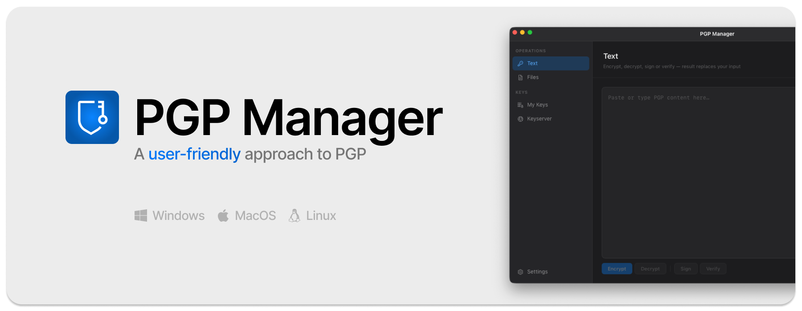

<p align="center">
  
</p>

<p align="center">
<a href="https://github.com/developaaah/pgp-manager/actions/workflows/release.yml"></a>
<a href="https://github.com/developaaah/pgp-manager/releases/latest"></a>
<a href="https://github.com/developaaah/pgp-manager/issues"></a>

<a href="https://gitgem.org/github/developaaah/pgp-manager"></a>
</p>

# PGP Manager

**A user-friendly approach to PGP.**

PGP Manager is a cross-platform OpenPGP desktop application for key management, encryption, decryption, digital signatures, and public key discovery.

Whether you're creating your first OpenPGP key pair or managing multiple existing identities, PGP Manager provides a modern desktop experience without changing the underlying standards.

PGP Manager is **not a new encryption system**. It is a simpler way to work with the OpenPGP tools and standards that already exist.

Available for **macOS**, **Windows**, and **Linux**.


<a href="https://www.producthunt.com/products/pgp-manager?embed=true&amp;utm_source=badge-featured&amp;utm_medium=badge&amp;utm_campaign=badge-pgp-manager" target="_blank" rel="noopener noreferrer"></a>

<br><br>

## Installation

### Download the latest release

Download the latest release for your platform from the [releases page](https://github.com/developaaah/pgp-manager/releases).

<p>
  <a href="https://github.com/developaaah/pgp-manager/releases/latest">
    
  </a>
</p>

* **macOS** — `.dmg` (Apple Silicon / Intel), drag the app into `/Applications`
* **Windows** — `pgpmanager.exe` (amd64 / 386)
* **Linux** — binary for amd64 / arm64 / 386

> [!TIP]
> You can also run it as a standalone app, e.g. from a USB drive. Point the storage directory to a folder on your drive when starting the app.

<br><br>

## Table of Contents

* [Why PGP Manager?](#why-pgp-manager)
* [New to OpenPGP?](#new-to-openpgp)
* [Features](#features)
  * [Core Features](#core-features)
  * [Standalone](#standalone)
  * [Clipboard auto-detect](#clipboard-auto-detect)
  * [System tray](#system-tray)
  * [Smart decryption and passphrase cache](#smart-decryption-and-passphrase-cache)
  * [macOS Services](#macos-services)
* [Security & Privacy](#security--privacy)
* [Frequently Asked Questions](#frequently-asked-questions)
* [Local Development](#local-development)
  * [Prerequisites](#prerequisites)
  * [Running in Development Mode](#running-in-development-mode)
  * [Building Binaries](#building-binaries)
* [Configuration Reference](#configuration-reference)
* [Project Layout](#project-layout)
* [Acknowledgements](#acknowledgements)
* [Contributing](#contributing)
* [Releases](#releases)
* [Support the Project](#support-the-project)
* [License](#license)

<br><br>

## Why PGP Manager?

OpenPGP is one of the most widely used standards for encryption and digital signatures.

The cryptography is mature, the ecosystem is well established, and the tooling has been trusted for decades. Yet many common workflows still require multiple applications, command-line tools, or a deep understanding of key management.

PGP Manager was built to remove that friction.

Generate keys, manage identities, search public keyservers, encrypt files, decrypt messages, and verify signatures from a single application while remaining fully compatible with existing OpenPGP standards and workflows.

Whether you're creating your first key pair or already working with GnuPG and public key infrastructure, PGP Manager provides a simpler way to interact with the OpenPGP ecosystem without introducing proprietary formats, cloud services, or vendor lock-in.

<br><br>

## New to OpenPGP?

PGP Manager simplifies the workflow, but understanding the basics of public keys, private keys, encryption, and digital signatures will help you get the most out of the application.

#### Learn the Fundamentals

- 📖 [OpenPGP for Beginners (KDE)](https://userbase.kde.org/Concepts/OpenPGP_For_Beginners)
- 📖 [PGP for Beginners](https://keychainpgp.org/docs/pgp-for-beginners/)
- 📖 [Fundamental Concepts: OpenPGP, GPG & PGP](https://gpgfrontend.bktus.com/guides/fundamental-concepts/)

#### Understand Public-Key Cryptography

- 📖 [OpenPGP Cryptographic Concepts](https://openpgp.dev/book/cryptography.html)
- 📖 [How OpenPGP Works](https://help.sap.com/docs/cloud-integration/sap-cloud-integration/how-openpgp-works)

#### Learn More About OpenPGP

- 📖 [OpenPGP for Application Developers](https://openpgp.dev/book/index.html)
- 📖 [FSFE OpenPGP Documentation](https://wiki.fsfe.org/TechDocs/OpenPGP)

Once you're comfortable with the basics, PGP Manager provides a straightforward way to perform those tasks without relying on command-line tools.

<br><br>

## Features

### Core Features

- **Key Management** <br>Create new OpenPGP identities, import existing key pairs, manage subkeys, and organize multiple identities from a single interface.
- **Encryption & Decryption** <br>Encrypt text and files for one or multiple recipients and decrypt incoming content without leaving the application.
- **Digital Signatures** <br>Create signatures for files and messages and verify signatures with clear validation results.
- **Public Key Discovery** <br>Search public keyservers directly from the application and import matching keys with a single click.
- **Multiple Identities** <br>Maintain separate identities for personal, professional, and project-specific communication.

### Standalone

Keep everything in a single directory and move it wherever you want.

Useful for:
* USB drives
* Multiple profiles
* Isolated environments
* Temporary workstations

### Clipboard auto-detect

While PGP Manager runs in the background, it monitors the clipboard with a lightweight change-counter poll — near-instant detection without continuously reading clipboard contents. What happens on detection is fully configurable in Settings:

| Content            | Action                                                                                                                       |
|:-------------------|:-----------------------------------------------------------------------------------------------------------------------------|
| Encrypted message  | Opens the window (on your current workspace), fills the text view and starts decryption — when a matching private key exists |
| Public key         | Opens the import dialog — for unknown keys only, all keys, or off                                                            |
| Private key        | Same as public keys, configured separately                                                                                   |
| Signed message     | Verified silently in the background — a system notification tells you whether the signature is valid and which key signed    |

### System tray

PGP Manager can live entirely in the system tray (menu bar on macOS). The tray menu is context-sensitive: it shows only the actions that apply to what's currently in your clipboard.

- Plain text → **Encrypt** / **Sign**
- Encrypted message → **Decrypt**
- Signed message → **Verify**
- Key block → **Import Key**

**Run in System Tray** controls whether the app starts hidden in the tray or as a regular window. **Launch at Login** adds PGP Manager to your OS login items.

### Smart decryption and passphrase cache

The matching private key is identified from the message's PKESK headers instead of trying every key. Unlocked passphrases are kept in memory for a configurable time (default 15 minutes, or never, 1 hour, until quit), so you only type your passphrase once per session.

### macOS Services

On macOS, PGP actions are available system-wide through the Services menu. Select text in any application — or files in Finder — right-click, and choose a **PGP:** entry: Encrypt, Decrypt, Sign, Verify, or Import Key. File actions (Encrypt File, Decrypt File, Sign File, Verify File) work on any file selection in Finder. Results open in the app window; signature checks arrive as a notification.

<br><br>

## Security & Privacy

PGP Manager is designed around a simple principle:

**Your keys belong to you.**

* Cryptographic operations are performed locally
* Private keys remain under your control
* No cloud synchronization
* No account registration
* No telemetry
* No proprietary key formats

Keys are only shared when you explicitly export or publish them.

Notifications never expose decrypted content.

### Technical Notes

* Cryptographic operations are performed using gopenpgp v3
* Private keys are stored as armored files
* Passphrases are only stored in memory
* Existing OpenPGP ecosystems remain fully compatible

<br><br>

## Frequently Asked Questions

### Getting Started

<details>
<summary><strong>Do I need GnuPG?</strong></summary>

No. PGP Manager works independently but can integrate with existing GnuPG environments where available.
</details>

<details>
<summary><strong>Can I import existing OpenPGP keys?</strong></summary>

Yes. Existing keys can be imported, managed, and used directly.
</details>

<details>
<summary><strong>Does PGP Manager work without an internet connection?</strong></summary>

Fully. Internet is only required for keyserver operations. Everything else — encryption, decryption, signing, verification, and key generation — works completely offline.
</details>

### Privacy & Security

<details>
<summary><strong>Do my keys or messages ever leave my device?</strong></summary>

No — unless you explicitly publish a public key to a keyserver. All encryption, decryption, signing, and verification runs locally. Keyserver lookups only transmit the search query (email address or fingerprint).
</details>

<details>
<summary><strong>Where exactly are my keys stored?</strong></summary>

In the directory you chose on first launch — by default `~/.pgp`. Each private key is an individual `.asc` file in that directory. You can change the storage location in **Settings → Storage**.
</details>

<details>
<summary><strong>What happens if I forget my passphrase?</strong></summary>

The private key file remains on disk, encrypted with the passphrase. There is no recovery mechanism — if the passphrase is lost, the key cannot be used. Keep a backup of your passphrase in a password manager.
</details>

### Compatibility & Technical Details

<details>
<summary><strong>Does PGP Manager use a proprietary format?</strong></summary>

No. PGP Manager works with standard OpenPGP formats and remains compatible with existing tools.
</details>

<details>
<summary><strong>Which key types and algorithms are supported?</strong></summary>

RSA (2048, 3072, 4096 bit) and Ed25519/Curve25519 for key generation. On import, any OpenPGP-compatible key is accepted. Encryption uses the recipient key's preferred algorithms as declared in the key.
</details>

<details>
<summary><strong>Is PGP Manager compatible with other PGP software?</strong></summary>

Yes. It speaks standard OpenPGP (RFC 4880), so messages and keys are interoperable with GPG, Kleopatra, Thunderbird/Enigmail, ProtonMail, and any other RFC 4880-compliant tool.
</details>

<br><br>

## Local Development
<p>


</p>

### Prerequisites

* Go 1.26+
* Node.js with yarn
* Wails v2 CLI
* Docker (Linux cross-builds only)
* Xcode Command Line Tools (macOS only)

### Running in Development Mode

```sh
make dev      # or `wails dev`
```

Hot reload is active for both backend and frontend components.

### Building Binaries

```sh
# macOS
make darwin

# DMG packages
make dmg-arm64
make dmg-amd64

# Windows
make windows

# Linux
make linux

# Complete release matrix
make release VERSION=v1.2.3
```

Build artifacts are written to `bin/`.

<br><br>

## Configuration Reference

The configuration file is stored as `config.toml`.

All options are also available through the application's settings interface.

| Key                            | Default   | Meaning                                                           |
|:-------------------------------|:----------|:------------------------------------------------------------------|
| `keys_dir`                     | `""`      | Directory for key files; empty stores them next to `config.toml` |
| `passphrase_cache_ttl_minutes` | `15`      | Passphrase cache lifetime (`0` never, `-1` until quit)            |
| `theme`                        | `dark`    | `dark`, `light` or `system`                                       |
| `custom_keyservers`            | `[]`      | Additional keyserver URLs                                         |
| `start_in_tray`                | `true`    | Start hidden in the system tray                                   |
| `clip_detect_messages`         | `true`    | Auto-decrypt detected encrypted messages                          |
| `clip_detect_public_keys`      | `unknown` | `off`, `unknown` (new keys only) or `all`                         |
| `clip_detect_private_keys`     | `unknown` | `off`, `unknown` or `all`                                         |
| `clip_detect_signatures`       | `true`    | Auto-verify signed messages (notification only)                   |
| `auto_copy_results`            | `true`    | Copy Encrypt/Sign results to the clipboard                        |

<br><br>

## Project Layout

```
app.go                  Wails bindings, action dispatch, clipboard monitor
main.go                 Wails bootstrap (window, tray start mode, single instance)
platform_*.go / *.m     Platform glue: macOS Services/NSStatusItem, tray, autostart
backend/
  autostart/            Launch-at-login (SMAppService / registry / XDG)
  cache/                In-memory passphrase cache
  clipboard/            Cheap clipboard change counters per OS
  config/               TOML config, first-run/standalone handling
  crypto/               Encrypt/decrypt/sign/verify for text + files, keygen, subkeys
  gnupg/                GnuPG home discovery + native keyring read
  install/              System-wide install (move to /Applications, desktop entry)
  keyserver/            HKP/VKS keyserver client
  keystore/             Armored key files on disk
  notification/         System notifications (verification results)
  tray/                 Windows/Linux system tray
frontend/               Svelte + Tailwind UI
build/                  Packaging: DMG script, Docker Linux builders, tray icons
```

<br><br>

## Acknowledgements

- [gopenpgp](https://github.com/ProtonMail/gopenpgp) — OpenPGP implementation
- [Wails](https://wails.io) — Go ↔ web desktop framework
- [Carbon Design System](https://carbondesignsystem.com/) — UI icons; the tray icon is carbon's `ibm--cloud--key-protect` (Apache 2.0)
- [fyne.io/systray](https://github.com/fyne-io/systray) — Windows/Linux tray
- The OpenPGP ecosystem and community

<br><br>

## Contributing

Bug reports and feature requests are welcome — please [open an issue](https://github.com/developaaah/pgp-manager/issues) first before submitting a pull request, so we can discuss scope and approach.

Here's the standard flow:

1. **Fork** the repository
2. **Clone** your fork: `git clone https://github.com/developaaah/pgp-manager-test.git`
3. **Branch**: `git checkout -b feature/your-feature`
4. **Commit**: `git commit -m 'feat: add some feature'`
5. **Push**: `git push origin feature/your-feature`
6. **Open** a pull request

Please follow the existing code style.

<br><br>

## Releases

Releases follow [Semantic Versioning](https://semver.org). Pushing a `v*` tag to `main` triggers the automated build pipeline, which produces signed binaries and DMGs for all supported platforms and publishes them to the [releases page](https://github.com/developaaah/pgp-manager/releases).

Pre-release builds (`v*-beta.*`, `v*-rc.*`) are published as pre-releases and will not trigger update notifications in stable builds.

<br><br>

## Support the Project

If PGP Manager saves you time or helps keep your communications secure, consider supporting its development.

<a href="https://www.producthunt.com/products/pgp-manager/reviews/new?utm_source=badge-product_review&utm_medium=badge&utm_source=badge-pgp&#0045;manager" target="_blank"></a>

[](https://paypal.me/dennischuster)

<details>
<summary><strong>☕ Crypto donations</strong></summary>

**Bitcoin (BTC)**
```
bc1qu78e7lea67dtj9tx2ld5vdh593y4hy40xv34x6
```

**Ethereum (ETH)**
```
0x5175742baEB558E430FD7709dc8bfC1129Dd2fDd
```

**Solana (SOL)**
```
H2XDLqFp2eVn7C83AhUYermbrsqqBTrFDbZ4UHxdaZwq
```

**Cardano (ADA)**
```
addr1qxasx7j94w8p3gatu4smqq2ufyzga0mpvxs786chs6ufk34mqdayt2uwrz36hetpkqq4cjgy36lkzcdpu0430p4cndrqahxsmx
```

**Monero (XMR)**
```
88v26pRFSVoT1SpzdAvhobhH5x2ECW8HLigwZHix6QhUFXwaez8TYDb5zjX9JA8un6LQkvDPnbZe2QyXwSHgfWQ53idtMbU
```

</details>

<br><br>

## License

PGP Manager is released under the [MIT License](LICENSE).
